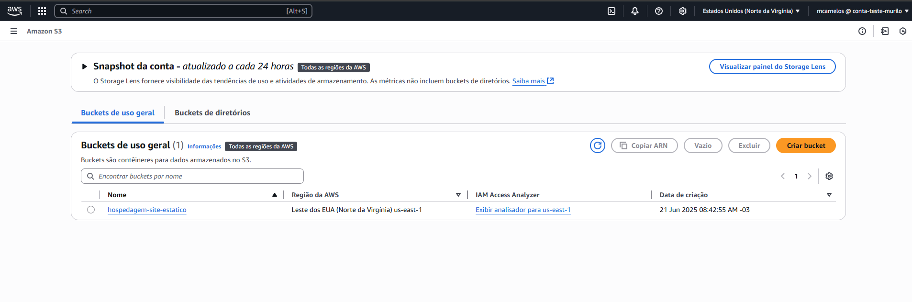
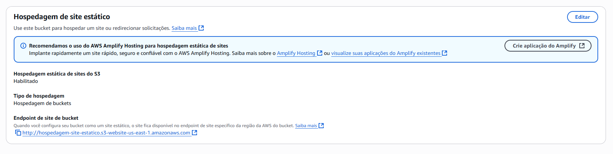
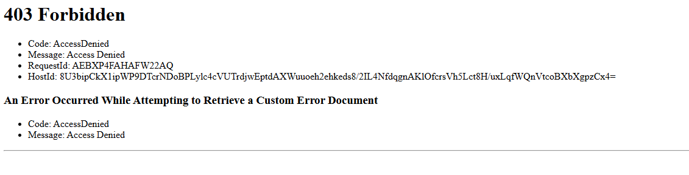
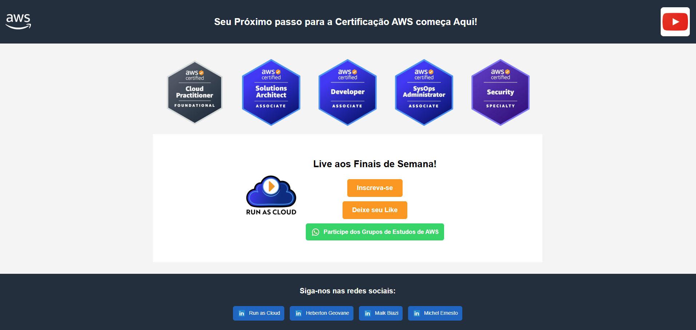

# 🌐 Projeto: Hospedagem de Site Estático na AWS S3

Este projeto demonstra como hospedar um site estático utilizando o serviço **Amazon S3 (Simple Storage Service)**. O objetivo foi entender como configurar buckets, permissões e publicar um site simples acessível publicamente pela internet.

---

## 🧰 Tecnologias Utilizadas

- ✅ **Amazon S3**
- ✅ AWS IAM
- ✅ HTML e CSS básicos
- ✅ Git e GitHub

---

## 📌 Etapas do Projeto

### 1. Criação do Bucket no S3

- Um bucket chamado `hospedagem-site-estatico` foi criado na região **us-east-1** (Norte da Virgínia).
- O bucket foi configurado para **não bloquear o acesso público**.

📷 *Imagem do bucket criado:*

---

### 2. Ativação da Hospedagem Estática

- A opção de **hospedagem de site estático** foi habilitada.
- Definido um **index.html** como página padrão.

📷 *Hospedagem ativada:*

---

### 3. Configuração das Permissões

- Criada uma policy pública do tipo `GetObject` para permitir leitura dos arquivos.
- Foi necessário editar manualmente as permissões do bucket e dos objetos.

> **Erro encontrado:**  
> Ao acessar o endpoint diretamente, ocorreu o erro `403 Forbidden`.

📷 *Erro 403:*

**Solução:**  
Foi necessário ajustar a policy pública do bucket conforme a documentação da AWS, permitindo leitura de arquivos anônimos.

---

### 4. Site Publicado com Sucesso 🚀

Após a correção das permissões, o site foi publicado com sucesso e acessado através do endpoint:

🔗 http://hospedagem-site-estatico.s3-website-us-east-1.amazonaws.com/

📷 *Site funcionando:*

---

## 🧠 Aprendizados

- Como criar e configurar buckets no S3 para uso estático
- Diferença entre bloqueio de acesso público e permissões de objetos
- Debug de erro 403 (Access Denied) no S3
- Organização de conteúdo estático na nuvem

---

## ✍️ Autor

**Murilo Carnelós**  
📧 muriloc.c@hotmail.com 
🔗 [LinkedIn](https://linkedin.com/in/murilo-carnelos)  
🔗 [Portfólio GitHub](https://github.com/mcarnelos)

---

## 📌 Próximos passos

- Habilitar **CloudFront** para distribuição via CDN  
- Adicionar **HTTPS com certificado SSL**  
- Automatizar deploy com **GitHub Actions**

---

⭐ **Se este projeto te ajudou ou inspirou, deixe uma estrela no repositório!**
